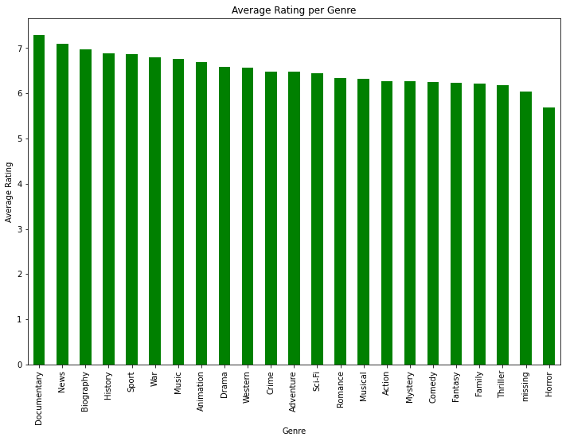
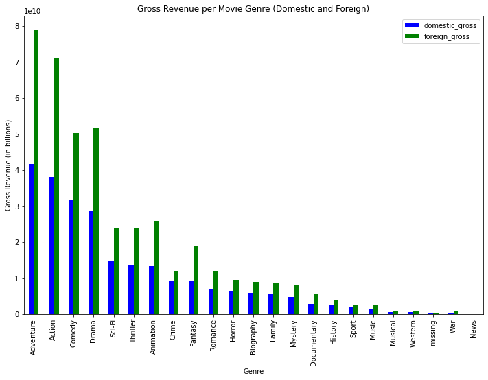
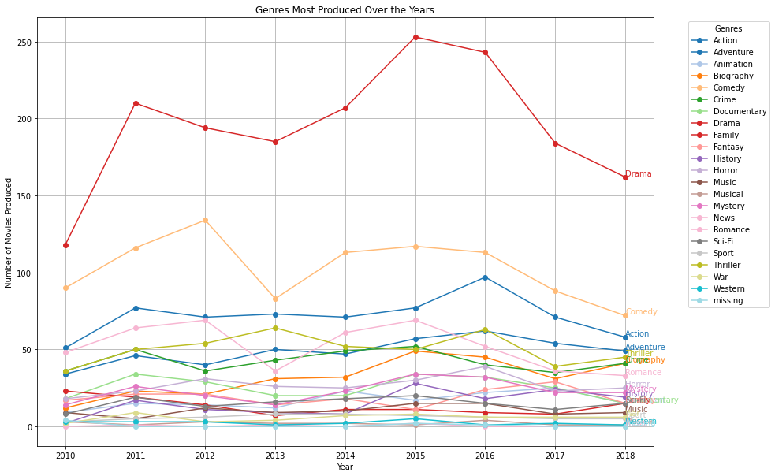
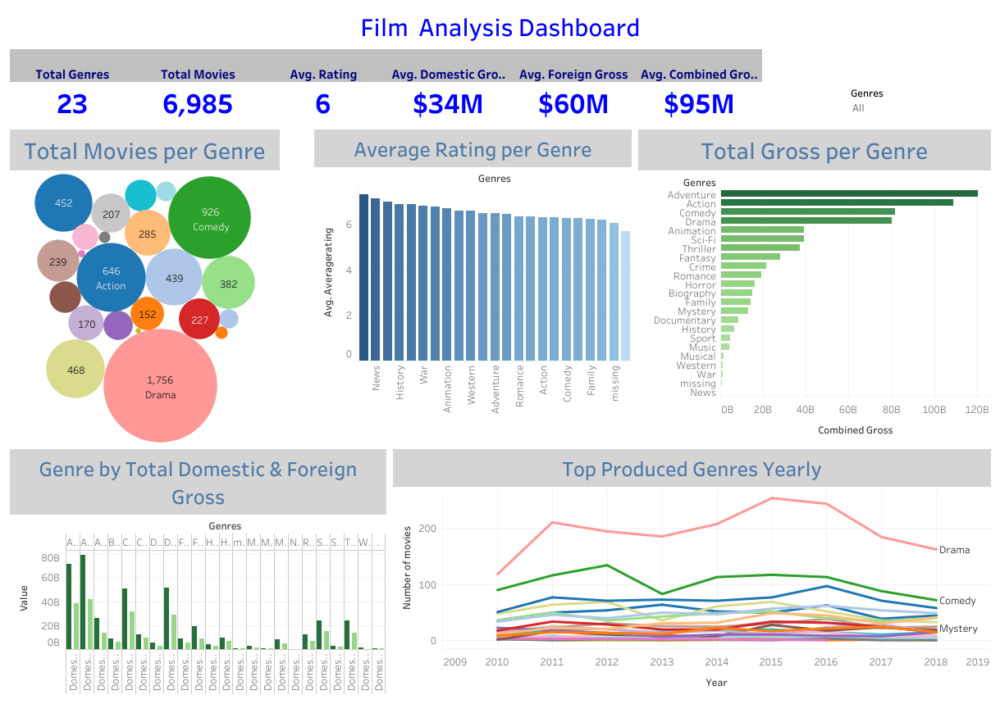

# Film Industry Performance Analysis
## Project Overview

This project analyzes movie performance data from Box Office Mojo, IMDB, Rotten Tomatoes, TheMovie DB and The Numbers that contain the movie ratings of different genres watched across the globe. The data obtained reflects a blend different films produced over the years and their performances domestically and internationally. Descriptibe analysis of the data shows that the fiml performance varies across different genre of movies. The company can use this analysis to determine best performing type of movies that can be best suited for making to ensure maximum profits are obtained and that they meet both domestic and international standards of the audience.

### Business Problem

The company, upon seeing all the big companies creating original video content, wants to venture into this industry and have therefore decided to create a new movie studio. Hhowever, they lack the knowledge on creating movies. You are charged with exploring what types of films are currently doing the best at the box office. This analysis, therefore, aims to tackle the main objective which is to identify the best performing type of films that would be suitable for the company to create so as to ensure high revenue and customer satiisfaction.

### Data

The data source of this analysis in from movie datasets whose data is obtained from:

These sites contain data on various types of films and their overall performance over the years domestically and internationally. This analysis focuses on two main files:
a)The 'bom.movie_gross.csv.gz' which is a csv file from [Box Office Mojo](https://www.boxofficemojo.com/) whose dataset contains records(rows) that contain various movies produced over the years and features that represents details of each movie produced such as the name, year released , studio, domestic and foreign gross.

b)The second file is the 'im.db' database from [IMDB](https://www.imdb.com/) which contains 8 tables with various details about each movie. From this dataset the most relevant tables will be the movie_basics and movie_ratings table.

The remaining datasets are useful in cleaning the data of the two relevant datasets. These other datasets are:

The 'rt.movie_info.tsv.gz' & 'rt.reviews.tsv.gz' datasets from [Rotten Tomatoes](https://www.rottentomatoes.com/) 

The 'tmdb.movies.csv.gz' dataset from [TheMovieDB](https://www.themoviedb.org/)

The 'tn.movie_budgets.csv.gz' dataset from [The Numbers](https://www.the-numbers.com/)

### Methods

This project utilizes descriptive analysis. It gives an overview of movie performance globally to dtermine the best performing type of film. The analysis shows the average movie ratings per genre, the domestic and foreign gross per genre and the most produced genres over the years. This analysis uses barccharts and line graphs to visualize these factors. A hypothesis test was conducted for the three analysis questions and there is use of a linear regression model.

### Results

Based on Average Rating per Genre, the top five genres are Documentary, News, Biography, History and Sport, having a slightly higher average ratings suggesting better critical reception and audience engagement.

Based on Gross per film, the genres generating significantly higher gross revenue, both domestically and internationally include Adventure,Action, Comedy,Drama and Animation films,indicating great performance globally.

Based on Most produced genres over the years, genres like Drama, Action,Comedy, Adventure and Thriller dominate production compared to less common genres, indicating popularity and preference among the audience.

In summary, genres that best suited for the company are Adventure, Action, Comedy and Drama as they all fairly match up to the industry standards in terms of having a high gross and popularly produced. Although the ratings are not the highest in these genres they still show above average ratings in the industry.

### Conclusion
This analysis leads to three conclusions and recommendations for the best suited type of film for the company to select:

1.Average Rating per Genre. From the analysis, most of the genres have fairly similar high ratings. However, certain genres consistently receive slightly higher average ratings thus indicating stronger audience satisfaction. Based on the results the top five genres are Documentary, News, Biography, History and Sport. H, The company might focus on producing more films in these genres with higher average ratings to attract a more engaged and satisfied audience and investing in high-quality productions within these genres to maintain or enhance rating levels and build a reputation for quality content.

2.Gross per film Genre. Based on the analysis, some genres generate significantly higher gross revenue, both domestically and internationally. These include, Adventure,Action, Comedy,Drama and Animation films, often have higher gross revenue compared to other genres. In terms of Domestic and Foreign Performance, most genres seem to perform better in international markets as compared to the domestic markets. The company should invest in creating films in these genres which have a high gross revenue potential, especially having a high international performance if aiming for global reach.

3.Most produced genres over the years. In conclusion to the analysis, some genres are produced more frequently than others. For instance, genres like Drama, Action,Comedy, Adventure and Thriller dominate production compared to less common genres. The high production volumes in these genres might indicate popularity among the audience. The company should consider producing film in these genres to match up to the current trends that capture the audiences' interest. However, the company should stay updated with industry trends to identify emerging genres or shifts in audience preferences and adjust the production strategy accordingly.

### Further Analysis

Further analysis could give more insights on other ways to best select types of films best suited for the company's new movie studio:

1.Analyzing audience demographics. These include age, gender, etc. for different genres. This could provide insights into who is watching which types of films.

2.Analyzing the viewer engagement metrics through tracking sentiments for different genres to gauge viewer engagement and interest.

3.Analysis of Profitability.There should be further analysis to determine the profitability of different genres by comparing production costs against gross revenue to identify which genres are more lucrative.

### For More Information

See the full analysis [Jupyter Notebook](Film_Performance_Analysis.ipynb)  or review the  [Presentation](Film_Data_Analaysis_Presentation.pdf)

## Dashboard

View the interactive [Tableau Dashboard](https://public.tableau.com/app/profile/maureen.wambugu/viz/Film_Analysis_Dashboard/FilmAnalysisDashboard?publish=yes) for detailed insights.

